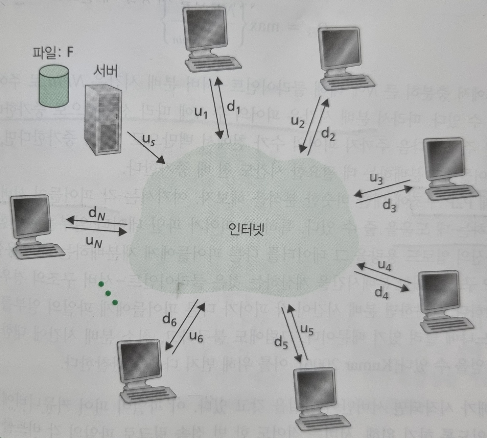
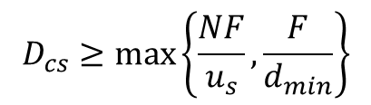
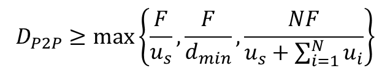

## 2.5 P2P 파일 분배

* 클라이언트-서버 파일 분배에서 서버는 파일 복사본을 각 피어들에게 보내야 한다. (서버에게 커다란 부하를 주고 많은 양의 서버 대역폭 소비)

* P2P 파일 분배에서 각 피어는 수신한 파일의 임의의 부분을 다른 피어들에게 재분배할 수 있어서 서버의 분배 프로세스를 도울 수 있다.

* P2P 구조의 확장성

  

  * 서버와 피어들은 접속 링크로 인터넷에 연결

  * 분배 시간(distribution time) : 모든 N개의 피어들이 파일의 복사본을 얻는 데 걸리는 시간

  * 클라이언트-서버 구조

    * 서버는 파일 복사본 N개를 피어 각각에게 전송해야 한다. 따라서 서버는 *NF* 비트를 전송해야한다. 파일을 분배하는 시간은 (전송해야 하는 전체 비트수 / 서버의 업로드 속도)이다.
    
    * 가장 낮은 다운로드 속도를 가진 피어는 (F / 다운로드 속도)보다 적은 시간에 파일의 모든 비트를 얻을 수 없다.
    
    * 분배 시간은 피어의 수 *N* 에 따라 선형적으로 증가한다.
    
  

  
    * P2P 구조	
  
        * 분배가 시작되면 서버만이 파일을 갖고 있다. 서버는 적어도 한 번 접속 링크로 파일의 각 비트를 보내야 한다. 따라서 최소 분배 시간은 적어도 (파일 하나의 비트 수 / 서버의 업로드 수)이다. 
        
        * 가장 낮은 다운로드 속도를 가진 피어는 (F / 다운로드 속도)보다 적은 시간에 파일의 모든 비트를 얻을 수 없다.
        
        * 시스템의 전체 업로드 용량은 전체적으로 서버의 업로드 속도와 각 피어들의 업로드 속도를 더한 것이다. 따라서 최소 분배 시간은 적어도 (NF / 전체 업로드 용량)이다.
  
  

  * 클라이언트-서버의 경우 피어의 수가 증가함에 따라 분배 시간이 선형적으로, 한계 없이 증가한다. 반면 P2P 구조의 경우 최소 분배 시간이 클리언트-서버 구조의 분배 시간보다 항상 작지는 않지만 임의의 피어 수 *N*에 대해서 1보다 작다. 따라서 P2P 구조를 가진 애플리케이션은 자가 확장성을 가진다.

* 비트토렌트

  * 토렌트(torrent) : 특정 파일의 분배에 참여하는 모든 피어들의 모임
  
  * 토렌트에 참여하는 피어들은 서로에게서 같은 크기의 청크(chunk)를 다운로드

  * 토렌트는 트랙커(tracker)라고 부르는 기반구조 노드를 갖고 있다.

    * 한 피어가 토렌트에 가입할 때 트랙커에 자신을 등록하고주기적으로 자신이 아직 토렌트에 있음을 알린다. 이러한 방식으로 트랙커는 토렌트에 참여하는 피어들을 추적한다.

  * 토렌트에 참여하는 피어들은 부분 집합 피어 리스트를 받고 이 리스트에 있는 피어들(이웃 피어)과 동시에 TCP 연결을 설정
  
    * 이웃 피어들은 시간에 따라 변동

  * 각 피어는 파일 청크들의 일부를 가지고 있고 이웃 피어들에게 그들이 갖고 있는 청크 리스트 요구, 갖고 있지 않은 청크에 대해 요구

    * 이 때, 청크는 가장 드문 것을 먼저 (rarest first)

  * DHT(Distributed Hash Table) : 데이터베이스 레코드가 P2P 시스템 피어에 분산되어 있는 단순한 데이터 베이스
